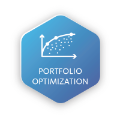

<!-- Improved compatibility of back to top link: See: https://github.com/othneildrew/Best-README-Template/pull/73 -->
<a id="readme-top"></a>
<!--
*** Thanks for checking out portfolio-optimization project. If you have a suggestion
*** that would make this better, please fork the repo and create a pull request
*** or simply open an issue with the tag "improvement".
*** Don't forget to give the project a star!
*** Thanks for checking out my project!
-->


<!-- PROJECT SHIELDS -->
<!--
*** I'm using markdown "reference style" links for readability.
*** Reference links are enclosed in brackets [ ] instead of parentheses ( ).
*** See the bottom of this document for the declaration of the reference variables
*** for contributors-url, forks-url, etc. This is an optional, concise syntax you may use.
*** https://www.markdownguide.org/basic-syntax/#reference-style-links
-->
[![Contributors][contributors-shield]][contributors-url]
[![Forks][forks-shield]][forks-url]
[![Stargazers][stars-shield]][stars-url]
[![Issues][issues-shield]][issues-url]
[![MIT License][license-shield]][license-url]
[![LinkedIn][linkedin-shield]][linkedin-url]


<!-- PROJECT LOGO -->
<br />
<div align="center">
  <a href="https://github.com/ClassicCollins/portfolio-optimization">
    
  </a>

<h3 align="center">Portfolio-Optimization and Asset Allocation</h3>

  <p align="center">
    An awesome projects to kick start your Portfolio Management!
    <br />
    <a href="https://github.com/ClassicCollins/portfolio-optimization"><strong>Explore the docs »</strong></a>
    <br />
    <br />
    <a href="https://colab.research.google.com/drive/1cJMj_UVBenWTKLo85dWIJ8rvmMjklR3F?usp=sharing">View Demo</a>
    ·
    <a href="https://github.com/ClassicCollins/portfolio-optimization/issues/new?labels=bug&template=bug-report---.md">Report Bug</a>
    ·
    <a href="https://github.com/ClassicCollins/portfolio-optimization/issues/new?labels=enhancement&template=feature-request---.md">Request Feature</a>
  </p>
</div>


<!-- TABLE OF CONTENTS -->
<details>
  <summary>Table of Contents</summary>
  <ol>
    <li>
      <a href="#about-the-project">About The Project</a>
      <ul>
        <li><a href="#built-with">Built With</a></li>
      </ul>
    </li>
    <li>
      <a href="#getting-started">Getting Started</a>
      <ul>
        <li><a href="#prerequisites">Prerequisites</a></li>
        <li><a href="#installation">Installation</a></li>
      </ul>
    </li>
    <li><a href="#usage">Usage</a></li>
    <li><a href="#roadmap">Roadmap</a></li>
    <li><a href="#contributing">Contributing</a></li>
    <li><a href="#license">License</a></li>
    <li><a href="#contact">Contact</a></li>
    <li><a href="#acknowledgments">Acknowledgments</a></li>
  </ol>
</details>


<!-- ABOUT THE PROJECT -->
## About The Project

[![Product Name Screen Shot][product-screenshot]](https://example.com)
This project focuses on constructing and optimizing a four-asset portfolio, utilizing a mix of value and growth stocks. The portfolio includes assets from both the technology and pharmaceutical industries.

## Project Overview
This notebook demonstrates the process of portfolio optimization using the Markowitz mean-variance optimization framework. The goal is to allocate investments across a portfolio of selected stocks to achieve the best possible balance between expected return and risk. 
Sounds good right :smile:

## Portfolio Composition
Value Stocks:
* `AMD` (Advanced Micro Devices, Inc.) - Technology
* `GOOGL` (Alphabet Inc.) - Technology
* `PFE` (Pfizer Inc.) - Pharmaceuticals
  
Growth Stocks:
* `MSFT` (Microsoft Corporation) - Technology
* `NVDA` (NVIDIA Corporation) - Technology

## Key Features
* `Markowitz Portfolio Optimization` : Calculation of the optimal asset weights for the portfolio to achieve the highest return for a given level of risk.
* `Brute Force Method` : Exploration of portfolio allocation using a brute force approach to compare different combinations of asset weights.
* `Efficient Frontier Visualization` : Visualization of the efficient frontier, illustrating the trade-off between risk and return in the portfolio.
`Asset Correlation Analysis` : Examination of the correlation between selected assets to understand the diversification benefits.

: `ClassicCollins`, `portfolio-optimization`, `@ClassicCollins2`, `https://www.linkedin.com/in/collins-ugwuozor`, `email_client`, `ugwuozorcollinsemezie@gmail.com`, `Asset_allocation`, `This project focuses on constructing and optimizing a four-asset portfolio, utilizing a mix of value and growth stocks. The portfolio includes assets from both the technology and pharmaceutical industries`

<p align="right">(<a href="#readme-top">back to top</a>)</p>


### Built With

* [![Python][Python-logo]][Python-url]
* [![Pandas][Pandas-logo]][Pandas-url]
* [![NumPy][NumPy-logo]][NumPy-url]
* [![Cvxpy][Cvxpy-logo]][Cvxpy-url]
* [![Matplotlib][Matplotlib-logo]][Matplotlib-url]
* [![Seaborn][Seaborn-logo]][Seaborn-url]
* [![Pandas DataReader][Pandas-DataReader-logo]][Pandas-DataReader-url]
* [![yfinance][yfinance-logo]][yfinance-url]

<p align="right">(<a href="#readme-top">back to top</a>)</p>


<!-- GETTING STARTED -->
## Getting Started

This is an example of how you may give instructions on setting up your project locally.
To get a local copy up and running follow these simple example steps.

### Prerequisites

This is an example of how to list things you need to use the software and how to install them.
* npm
  ```sh
  npm install npm@latest -g
  ```

### Installation

1. Get a free API Key at [https://example.com](https://example.com)
2. Clone the repo
   ```sh
   git clone https://github.com/github_username/repo_name.git
   ```
3. Install NPM packages
   ```sh
   npm install
   ```
4. Enter your API in `config.js`
   ```js
   const API_KEY = 'ENTER YOUR API';
   ```
5. Change git remote url to avoid accidental pushes to base project
   ```sh
   git remote set-url origin github_username/repo_name
   git remote -v # confirm the changes
   ```

<p align="right">(<a href="#readme-top">back to top</a>)</p>


<!-- USAGE EXAMPLES -->
## Usage

Use this space to show useful examples of how a project can be used. Additional screenshots, code examples and demos work well in this space. You may also link to more resources.

_For more examples, please refer to the [Documentation](https://example.com)_

<p align="right">(<a href="#readme-top">back to top</a>)</p>


<!-- ROADMAP -->
## Roadmap

- [ ] Feature 1
- [ ] Feature 2
- [ ] Feature 3
    - [ ] Nested Feature

See the [open issues](https://github.com/github_username/repo_name/issues) for a full list of proposed features (and known issues).

<p align="right">(<a href="#readme-top">back to top</a>)</p>


<!-- CONTRIBUTING -->
## Contributing

Contributions are what make the open source community such an amazing place to learn, inspire, and create. Any contributions you make are **greatly appreciated**.

If you have a suggestion that would make this better, please fork the repo and create a pull request. You can also simply open an issue with the tag "enhancement".
Don't forget to give the project a star! Thanks again!

1. Fork the Project
2. Create your Feature Branch (`git checkout -b feature/AmazingFeature`)
3. Commit your Changes (`git commit -m 'Add some AmazingFeature'`)
4. Push to the Branch (`git push origin feature/AmazingFeature`)
5. Open a Pull Request

<p align="right">(<a href="#readme-top">back to top</a>)</p>

### Top contributors:

<a href="https://github.com/ClassicCollins/portfolio-optimization/graphs/contributors">
  
</a>


<!-- LICENSE -->
## License

Distributed under the MIT License. See `LICENSE.txt` for more information.

<p align="right">(<a href="#readme-top">back to top</a>)</p>


<!-- CONTACT -->
## Contact

Collins Emezie Ugwuozor - [@twitter_handle](https://x.com/ClassicCollins2) - ugwuozorcollinsemezie@gmail.com

Project Link: [https://github.com/ClassicCollins/portfolio-optimization](https://github.com/ClassicCollins/portfolio-optimization)

<p align="right">(<a href="#readme-top">back to top</a>)</p>


<!-- ACKNOWLEDGMENTS -->
## Acknowledgments

* []()
* []()
* []()

<p align="right">(<a href="#readme-top">back to top</a>)</p>


<!-- MARKDOWN LINKS & IMAGES -->
<!-- https://www.markdownguide.org/basic-syntax/#reference-style-links -->
[contributors-shield]: https://img.shields.io/github/contributors/ClassicCollins/portfolio-optimization.svg?style=for-the-badge
[contributors-url]: https://github.com/ClassicCollins/portfolio-optimization/graphs/contributors
[forks-shield]: https://img.shields.io/github/forks/ClassicCollins/portfolio-optimization.svg?style=for-the-badge
[forks-url]: https://github.com/ClassicCollins/portfolio-optimization/network/members
[stars-shield]: https://img.shields.io/github/stars/ClassicCollins/portfolio-optimization.svg?style=for-the-badge
[stars-url]: https://github.com/ClassicCollins/portfolio-optimization/stargazers
[issues-shield]: https://img.shields.io/github/issues/ClassicCollins/portfolio-optimization.svg?style=for-the-badge
[issues-url]: https://github.com/ClassicCollins/portfolio-optimization/issues
[license-shield]: https://img.shields.io/github/license/ClassicCollins/portfolio-optimization.svg?style=for-the-badge
[license-url]: https://github.com/ClassicCollins/portfolio-optimization/blob/master/LICENSE.txt
[linkedin-shield]: https://img.shields.io/badge/-LinkedIn-black.svg?style=for-the-badge&logo=linkedin&colorB=555
[linkedin-url]: https://linkedin.com/in/collins-ugwuozor
[product-screenshot]: images/screenshot.png
[Next.js]: https://img.shields.io/badge/next.js-000000?style=for-the-badge&logo=nextdotjs&logoColor=white
[Next-url]: https://nextjs.org/
[React.js]: https://img.shields.io/badge/React-20232A?style=for-the-badge&logo=react&logoColor=61DAFB
[React-url]: https://reactjs.org/
[Vue.js]: https://img.shields.io/badge/Vue.js-35495E?style=for-the-badge&logo=vuedotjs&logoColor=4FC08D
[Vue-url]: https://vuejs.org/
[Angular.io]: https://img.shields.io/badge/Angular-DD0031?style=for-the-badge&logo=angular&logoColor=white
[Angular-url]: https://angular.io/
[Svelte.dev]: https://img.shields.io/badge/Svelte-4A4A55?style=for-the-badge&logo=svelte&logoColor=FF3E00
[Svelte-url]: https://svelte.dev/
[Laravel.com]: https://img.shields.io/badge/Laravel-FF2D20?style=for-the-badge&logo=laravel&logoColor=white
[Laravel-url]: https://laravel.com
[Bootstrap.com]: https://img.shields.io/badge/Bootstrap-563D7C?style=for-the-badge&logo=bootstrap&logoColor=white
[Bootstrap-url]: https://getbootstrap.com
[JQuery.com]: https://img.shields.io/badge/jQuery-0769AD?style=for-the-badge&logo=jquery&logoColor=white
[JQuery-url]: https://jquery.com
[Python-logo]: https://img.shields.io/badge/Python-20232A?style=for-the-badge&logo=python&logoColor=61DAFB
[Python-url]: https://www.python.org/
[Pandas-logo]: https://img.shields.io/badge/Pandas-20232A?style=for-the-badge&logo=pandas&logoColor=blue
[Pandas-url]: https://pandas.pydata.org/
[NumPy-logo]: https://img.shields.io/badge/Numppy-20232A?style=for-the-badge&logo=numpy&logoColor=61DAFB
[NumPy-url]: https://numpy.org/
[Cvxpy-logo]: https://img.shields.io/badge/Cvxpy-0769AD?style=for-the-badge&logo=cvxpy&logoColor=white
[Cvxpy-url]: https://www.cvxpy.org/
[Matplotlib-logo]: https://img.shields.io/badge/Matplotlib-red?style=for-the-badge&logo=matplotlib&logoColor=0769AD
[Matplotlib-url]: https://matplotlib.org/ 
[Seaborn-logo]: https://img.shields.io/badge/Seaborn-20232A?style=for-the-badge&logo=seaborn&logoColor=61DAFB
[Seaborn-url]: https://seaborn.pydata.org/
[Pandas-DataReader-logo]: https://img.shields.io/badge/Pandas-DataReader-20232A?style=for-the-badge&logo=Pandas-DataReader&logoColor=61DAFB
[Pandas-DataReader-url]: https://pandas-datareader.readthedocs.io/en/latest/
[yfinance-logo]: https://img.shields.io/badge/Yfinance-0769AD?style=for-the-badge&logo=yfinance&logoColor=white
[yfinance-url]:  https://pypi.org/project/yfinance/
