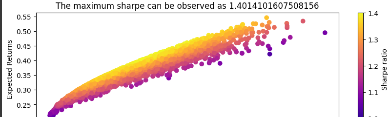

<!-- Improved compatibility of back to top link: See: https://github.com/ClassicCollins/portfolio-optimization/back2top -->
<a id="readme-top"></a>
<!--
*** Thanks for checking out portfolio-optimization and asset allocation project. 
*** If you have a suggestion that would make this better, please fork the repo and 
*** create a pull request or simply open an issue with the tag "enhancement".
*** Don't forget to give the project a star!
*** Thanks for checking out my project!
-->


<!-- PROJECT SHIELDS -->
<!--
*** I'm using markdown "reference style" links for readability.
*** Reference links are enclosed in brackets [ ] instead of parentheses ( ).
*** See the bottom of this document for the declaration of the reference variables
*** for stars-url, forks-url, etc.
*** https://www.markdownguide.org/basic-syntax/#reference-style-links 
-->


[![Forks][forks-shield]][forks-url]
[![Stargazers][stars-shield]][stars-url]
[![Issues][issues-shield]][issues-url]
[![MIT License][license-shield]][license-url]
[![Python][Python-logo]][Python-url]
[![LinkedIn][linkedin-shield]][linkedin-url]
[![Twitter][twitter-shield]][twitter-url]


<!-- PROJECT LOGO -->
<br />
<div align="center">
  <a href="https://github.com/ClassicCollins/portfolio-optimization">
    
  </a>

<h3 align="center">Portfolio-Optimization and Asset Allocation</h3>

  <p align="center">
    An awesome project to jumpstart your journey into Asset Allocation and Portfolio Optimization!
    <br />
    <a href="https://github.com/ClassicCollins/portfolio-optimization"><strong>Explore the docs »</strong></a>
    <br />
    <br />
    <a href="https://colab.research.google.com/drive/1cJMj_UVBenWTKLo85dWIJ8rvmMjklR3F?usp=sharing">View Demo</a>
    ·
    <a href="https://github.com/ClassicCollins/portfolio-optimization/blob/main/.github/ISSUE_TEMPLATE/bug-report---.md">Report Bug</a>
    ·
    <a href="https://github.com/ClassicCollins/portfolio-optimization/blob/main/.github/ISSUE_TEMPLATE/feature-request---.md">Request Feature</a>
  </p>
</div>


<!-- TABLE OF CONTENTS -->
<details>
  <summary>Click Table of Contents</summary>
  <ol>
    <li>
      <a href="#about-the-project">About The Project</a>
      <ul>
        <li><a href="#Project Overview">Project Overview</a></li>
        <li><a href="#Portfolio Composition">Portfolio Composition</a></li>
        <li><a href="#Key Features">Key Features</a></li>
        <li><a href="#Tools and Libraries">Tools and Libraries</a></li>
      </ul>
    </li>
    <li>
      <a href="#getting-started">Getting Started</a>
      <ul>
        <li><a href="#Required Packages">Required Packages</a></li>
        <li><a href="#installation">Installation</a></li>
      </ul>
    </li>
    <li><a href="#Video explanation">Video Explanation</a></li>
    <li><a href="#roadmap">Roadmap</a></li>
    <li><a href="#contributing">Contributing</a></li>
    <li><a href="#license">License</a></li>
    <li><a href="#contact">Contact</a></li>
    <li><a href="#acknowledgments">Acknowledgments</a></li>
  </ol>
</details>


<!-- ABOUT THE PROJECT -->
## About The Project

[![Product Name Screen Shot][product-screenshot]](https://colab.research.google.com/drive/1cJMj_UVBenWTKLo85dWIJ8rvmMjklR3F?usp=sharing#scrollTo=7d4PQ64OL3jP)

This project focuses on constructing and optimizing a five-asset portfolio, utilizing a mix of value and growth stocks. The portfolio includes assets from both the technology and pharmaceutical industries.

### Project Overview
This project demonstrates the process of portfolio optimization using the Markowitz mean-variance optimization framework. The goal is to allocate investments across a portfolio of selected stocks to achieve the best possible balance between expected return and risk. 
Sounds good right? :smile:

### Portfolio Composition
Value Stocks:
* `AMD` (Advanced Micro Devices, Inc.) - Technology
* `GOOGL` (Alphabet Inc.) - Technology
* `PFE` (Pfizer Inc.) - Pharmaceuticals
  
Growth Stocks:
* `MSFT` (Microsoft Corporation) - Technology
* `NVDA` (NVIDIA Corporation) - Technology

### Key Features
* `Markowitz Portfolio Optimization` : Calculation of the optimal asset weights for the portfolio to achieve the highest return for a given level of risk.
* `Brute Force Method` : Exploration of portfolio allocation using a brute force approach to compare different combinations of asset weights.
* `Efficient Frontier Visualization` : Visualization of the efficient frontier, illustrating the trade-off between risk and return in the portfolio.
`Asset Correlation Analysis` : Examination of the correlation between selected assets to understand the diversification benefits.


<p align="right">(<a href="#readme-top">back to top</a>)</p>


### Tools and Libraries

* [![Python][Python-logo]][Python-url]
* [![Pandas][Pandas-logo]][Pandas-url]
* [![NumPy][NumPy-logo]][NumPy-url]
* [![Cvxpy][Cvxpy-logo]][Cvxpy-url]
* [![Matplotlib][Matplotlib-logo]][Matplotlib-url]
* [![Seaborn][Seaborn-logo]][Seaborn-url]
* [![Pandas DataReader][Pandas-DataReader-logo]][Pandas-DataReader-url]
* [![yfinance][yfinance-logo]][yfinance-url]

<p align="right">(<a href="#readme-top">back to top</a>)</p>

<!-- STEPS and METHODOLOGY -->
## Steps and Methodology
* Data Collection: Retrieved historical stock price data for the selected assets using yfinance.
* Markowitz Optimization:
  Calculated expected returns, variances, and covariances of the assets.
  Applied the Markowitz optimization model to determine the optimal asset allocation.
* Efficient Frontier:
  Plotted the efficient frontier to visualize the trade-off between portfolio risk and return.
* Brute Force Method:
  Implemented a brute force method to explore various combinations of asset allocations.
  Compared the results with the Markowitz optimization.
* Conclusion: Summarized the optimal portfolio composition and its expected performance.

<p align="right">(<a href="#readme-top">back to top</a>)</p>

<!-- RESULTS -->
## Results
The optimized portfolio achieved a balanced risk-return profile, with a diversified allocation across value and growth stocks in the tech and pharmaceutical sectors.

<p align="right">(<a href="#readme-top">back to top</a>)</p>
<!-- GETTING STARTED -->
## Getting Started

To get a local copy up and running follow these simple example steps.

### Install Required Packages

Ensure you have Python installed and then run:
* requirement
  ```sh
  pip install -r requirements.txt
  ```

### Installation

1. Clone the repo
   ```sh
   git clone https://github.com/ClassicCollins/portfolio-optimization.git
   ```
2. Install required packages
   ```sh
   pip install -r requirements.txt
   ```
3. Run the Notebook: Open the notebook in Jupyter and run the cells to reproduce the analysis:
   ```sh
   jupyter notebook Portfolio_optimization.ipynb
   ```
4. Change git remote url to avoid accidental pushes to base project
   ```sh
   git remote set-url origin github_username/repo_name
   git remote -v # confirm the changes
   ```

<p align="right">(<a href="#readme-top">back to top</a>)</p>


<!-- USAGE EXAMPLES -->
## Video Explanation

For more explanation on Portfolio optimization and Efficient frontier, please watch the [YoutubeVideo](https://www.youtube.com/watch?v=vnAbsNN3SbA)

<p align="right">(<a href="#readme-top">back to top</a>)</p>


<!-- ROADMAP -->
## Roadmap

- [x] Add Changelog
- [x] Add back to top links
- [ ] Build a ten asset portfolio

See the [open issues](https://github.com/ClassicCollins/portfolio-optimization/issues) for a full list of proposed features (and known issues).

<p align="right">(<a href="#readme-top">back to top</a>)</p>


<!-- CONTRIBUTING -->
## Contributing

Contributions are what make the open source community such an amazing place to learn, inspire, and create. Any contributions you make are **greatly appreciated**.

If you have a suggestion that would make this better, please fork the repo and create a pull request. You can also simply open an issue 
with the tag "enhancement". Don't forget to give the project a star! Thanks again!

1. Fork the Project
2. Create your Feature Branch (`git checkout -b feature/AmazingFeature`)
3. Commit your Changes (`git commit -m 'Add some AmazingFeature'`)
4. Push to the Branch (`git push origin feature/AmazingFeature`)
5. Open a Pull Request

<p align="right">(<a href="#readme-top">back to top</a>)</p>


<!-- LICENSE -->
## License

Distributed under the MIT License. See `LICENSE.txt` at the top for more information.

<p align="right">(<a href="#readme-top">back to top</a>)</p>


<!-- CONTACT -->
## Contact

Collins Emezie Ugwuozor - [@twitter_handle](https://x.com/ClassicCollins2) - ugwuozorcollinsemezie@gmail.com

Project Link: [https://github.com/ClassicCollins/portfolio-optimization](https://github.com/ClassicCollins/portfolio-optimization)

<p align="right">(<a href="#readme-top">back to top</a>)</p>


<!-- ACKNOWLEDGMENTS -->
## Acknowledgments

* [Python](https://www.python.org)
* [Img Shields](https://shields.io)
* [yfinace](https://pypi.org/project/yfinance)
* [othneildrew](https://github.com/othneildrew/Best-README-Template)
* [Google Colab](https://colab.research.google.com/)
* [MIT License](https://opensource.org/license/mit)

  
<p align="right">(<a href="#readme-top">back to top</a>)</p>

<!-- DISCLAIMER -->


## Disclaimer 

This portfolio optimization and asset allocation project is for educational purposes only and does not constitute investment advice. Always consult with a financial advisor before making any investment decisions.

<p align="right">(<a href="#readme-top">back to top</a>)</p>


<!-- MARKDOWN LINKS & IMAGES -->
<!-- https://www.markdownguide.org/basic-syntax/#reference-style-links -->
[contributors-shield]: https://img.shields.io/github/contributors/ClassicCollins/portfolio-optimization.svg?style=for-the-badge
[contributors-url]: https://github.com/ClassicCollins/portfolio-optimization/contributors
[twitter-shield]: https://img.shields.io/badge/-Twitter-black.svg?style=for-the-badge&logo=x&colorB=555
[twitter-url]: https://x.com/ClassicCollins2
[traffic-shield]: https://img.shields.io/github/traffic/ClassicCollins/portfolio-optimization.svg?style=for-the-badge
[traffic-url]: https://github.com/ClassicCollins/portfolio-optimization/traffic
[forks-shield]: https://img.shields.io/github/forks/ClassicCollins/portfolio-optimization.svg?style=for-the-badge
[forks-url]: https://github.com/ClassicCollins/portfolio-optimization/forks
[stars-shield]: https://img.shields.io/github/stars/ClassicCollins/portfolio-optimization.svg?style=for-the-badge
[stars-url]: https://github.com/ClassicCollins/portfolio-optimization/stargazers
[issues-shield]: https://img.shields.io/github/issues/ClassicCollins/portfolio-optimization.svg?style=for-the-badge
[issues-url]: https://github.com/ClassicCollins/portfolio-optimization/issues
[license-shield]: https://img.shields.io/github/license/ClassicCollins/portfolio-optimization.svg?style=for-the-badge
[license-url]: https://github.com/ClassicCollins/portfolio-optimization/blob/master/LICENSE.txt
[linkedin-shield]: https://img.shields.io/badge/-LinkedIn-white.svg?style=for-the-badge&logo=linkedin&colorB=blue
[linkedin-url]: https://linkedin.com/in/collins-ugwuozor
[product-screenshot]: images/screenshot.png
[Python-logo]: https://img.shields.io/badge/Python-20232A?style=for-the-badge&logo=python&logoColor=61DAFB
[Python-url]: https://www.python.org/
[Pandas-logo]: https://img.shields.io/badge/Pandas-20232A?style=for-the-badge&logo=pandas&logoColor=blue
[Pandas-url]: https://pandas.pydata.org/
[NumPy-logo]: https://img.shields.io/badge/Numppy-20232A?style=for-the-badge&logo=numpy&logoColor=61DAFB
[NumPy-url]: https://numpy.org/
[Cvxpy-logo]: https://img.shields.io/badge/Cvxpy-0769AD?style=for-the-badge&logo=cvxpy&logoColor=white
[Cvxpy-url]: https://www.cvxpy.org/
[Matplotlib-logo]: https://img.shields.io/badge/Matplotlib-red?style=for-the-badge&logo=matplotlib&logoColor=0769AD
[Matplotlib-url]: https://matplotlib.org/ 
[Seaborn-logo]: https://img.shields.io/badge/Seaborn-20232A?style=for-the-badge&logo=seaborn&logoColor=61DAFB
[Seaborn-url]: https://seaborn.pydata.org/
[Pandas-DataReader-logo]: https://img.shields.io/badge/Pandas-DataReader-20232A?style=for-the-badge&logo=Pandas-DataReader&logoColor=61DAFB
[Pandas-DataReader-url]: https://pandas-datareader.readthedocs.io/en/latest/
[yfinance-logo]: https://img.shields.io/badge/Yfinance-0769AD?style=for-the-badge&logo=yfinance&logoColor=white
[yfinance-url]:  https://pypi.org/project/yfinance/
